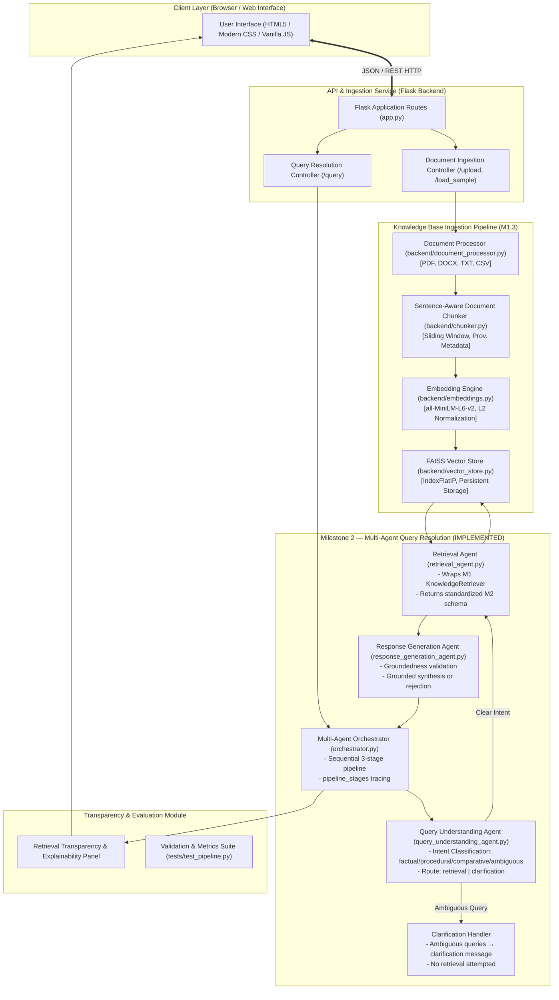

# System Architecture & Technical Design Specification
**Project**: AI-Based Knowledge Retrieval Platform with Query Resolution System  
**Milestones**: Milestone 1 (Foundation & Knowledge Retrieval) + Milestone 2 (Multi-Agent Query Resolution)  
**Author**: Virtual Internship Project Team  
**Date**: September 2026  

---

## 1. Executive Summary & Problem Formulation

Traditional document retrieval relies on lexical keyword searches (e.g., BM25, grep), which fail when queries are phrased using synonyms, conceptual abstractions, or natural conversational language. Conversely, standalone Large Language Models (LLMs) hallucinate facts and lack access to private, enterprise, or recently updated domain documents.

This platform bridges that gap by implementing an enterprise-grade **Retrieval-Augmented Generation (RAG)** architecture with a modular foundation designed to support **Multi-Agent Query Resolution**, **Web Speech Voice Interaction**, and **Deterministic Factual Grounding**.

---

## 2. End-to-End System Architecture



---

## 3. Multi-Agent Roles & Responsibilities Specification (M1.2 Design → M2 Implementation)

The following table describes each agent's role as designed in M1.2 and implemented in Milestone 2:

| Agent Name | Core Responsibilities | Input Contract | Output Contract | Implementation Status |
| :--- | :--- | :--- | :--- | :--- |
| **Query Understanding Agent** | Classifies query as `factual`, `procedural`, `comparative`, or `ambiguous`. Uses regex + vague-token detection. Determines route: `retrieval` or `clarification`. | `raw_query: str` | `{query_type, classification_confidence, route, reasoning}` | ✅ **M2 ACTIVE** — [`backend/query_understanding_agent.py`](file:///C:/Users/GeethaJyothi/.gemini/antigravity/scratch/knowledge-retrieval-platform/backend/query_understanding_agent.py) |
| **Knowledge Retrieval Agent** | Wraps M1 `KnowledgeRetriever`. Embeds query, executes FAISS vector search, applies lexical reranking and threshold filtering. Returns M2-standardized schema. | `query: str`, `query_type: str`, `top_k, threshold` | `{results[], retrieval_confidence, confidence_label, status, raw_retrieval_data}` | ✅ **M2 ACTIVE** — [`backend/retrieval_agent.py`](file:///C:/Users/GeethaJyothi/.gemini/antigravity/scratch/knowledge-retrieval-platform/backend/retrieval_agent.py) |
| **Response Generation Agent** | Validates groundedness (keyword overlap + confidence threshold), then synthesizes answer strictly from retrieved chunks. Handles clarification and rejection cases. | `query: str`, `query_type: str`, `retrieval_output: dict` | `{answer, sources, confidence, status, debug_details}` | ✅ **M2 ACTIVE** — [`backend/response_generation_agent.py`](file:///C:/Users/GeethaJyothi/.gemini/antigravity/scratch/knowledge-retrieval-platform/backend/response_generation_agent.py) |
| **Multi-Agent Orchestrator** | Coordinates all three agents sequentially. Produces `pipeline_stages` list for full traceability. Routes ambiguous queries directly to clarification without retrieval. | `query: str` | `{query, query_type, route, answer, confidence, sources, status, pipeline_stages, debug_details}` | ✅ **M2 ACTIVE** — [`backend/orchestrator.py`](file:///C:/Users/GeethaJyothi/.gemini/antigravity/scratch/knowledge-retrieval-platform/backend/orchestrator.py) |
| **Clarification Agent** | Detects under-specified queries. Generates clarifying guidance message instead of guessing. | Ambiguous query route | `ClarificationRequest` / clarification message | ✅ **M2 ACTIVE** — handled inline in `ResponseGenerationAgent` |
| **Conversation Memory Agent** | Maintains multi-turn history and session state. | `session_id`, query/response turns | Context buffer | 🔲 **Planned — Milestone 3** — modeled in [`models.py`](file:///C:/Users/GeethaJyothi/.gemini/antigravity/scratch/knowledge-retrieval-platform/backend/models.py) (`AgentMessage`) |


---

## 4. Ingestion Pipeline Data Flow (M1.3)

```
[Document Upload: PDF / DOCX / TXT / CSV]
                     │
                     ▼
       1. DocumentProcessor.extract()
          - Format detection & security sanitization
          - PDF: pypdf page-by-page extraction
          - DOCX: python-docx paragraph extraction
          - TXT: UTF-8 decoded normalization
          - CSV: atomic row-level extraction with header preservation
                     │
                     ▼
       2. DocumentChunker.chunk_document()
          - Sliding-window sentence-aware chunking
          - Window size: 500 characters, Overlap: 100 characters
          - CSV: each row preserved as an atomic record
          - Provenance metadata attached (page_number, row_number, source_id)
                     │
                     ▼
       3. EmbeddingEngine.generate_embeddings()
          - SentenceTransformers local model (`all-MiniLM-L6-v2`)
          - Dimension: 384 float32
          - L2 Unit Normalization (enables inner product == cosine similarity)
                     │
                     ▼
       4. VectorStore.add_documents()
          - FAISS `IndexFlatIP` indexing
          - Atomic persistence to disk (`index.faiss` + `metadata.pkl`)
          - Duplicate document de-duplication & synchronization
```

---

## 5. Milestone 2 — Multi-Agent Query Resolution Flow

```
User Query (HTTP POST /query)
        │
        ▼
┌─────────────────────────────────────────────────────────────┐
│  Stage 1 — QueryUnderstandingAgent.analyze(query)            │
│                                                              │
│  Pattern matching against factual/procedural/comparative     │
│  trigger phrases. Vague-token detection for ambiguous.       │
│  → query_type  (factual | procedural | comparative |         │
│                  ambiguous)                                   │
│  → classification_confidence  (0.0 – 1.0)                   │
│  → route  (retrieval | clarification)                        │
└──────────────────────┬──────────────────────────────────────┘
                       │
         ┌─────────────┴──────────────┐
         │ route == "retrieval"       │ route == "clarification"
         ▼                            ▼
┌─────────────────┐         ┌────────────────────────────┐
│ Stage 2 —       │         │ Stage 2 SKIPPED             │
│ RetrievalAgent  │         │ Ambiguous query routed to   │
│ .retrieve()     │         │ ResponseGenerationAgent     │
│                 │         │ directly                    │
│ → FAISS search  │         └────────────┬───────────────┘
│ → threshold     │                      │
│   filtering     │                      │
│ → confidence    │                      │
│   metadata      │                      │
└────────┬────────┘                      │
         │                               │
         ▼                               ▼
┌─────────────────────────────────────────────────────────────┐
│  Stage 3 — ResponseGenerationAgent.generate()               │
│                                                              │
│  If ambiguous  → return CLARIFICATION_MESSAGE               │
│  If no_results → return REJECTION_MESSAGE                   │
│  If results but retrieval_conf < 0.40 and no keyword match  │
│               → return REJECTION_MESSAGE (groundedness)     │
│  Otherwise    → call ResponseGenerator.generate_response()  │
│               → grounded answer from retrieved context      │
└──────────────────────┬──────────────────────────────────────┘
                       │
                       ▼
           Flask /query endpoint returns:
           {
             "answer": str,
             "query_type": str,
             "classification_confidence": float,
             "route": str,
             "confidence": str,      # High | Medium | Low | None
             "sources": [...],
             "status": str,          # success | no_results | clarification_needed
             "pipeline_stages": [    # Full stage trace for UI
               { "stage": 1, "name": "Query Understanding Agent", ... },
               { "stage": 2, "name": "Retrieval Agent", ... },
               { "stage": 3, "name": "Response Generation Agent", ... }
             ]
           }
```

---

## 6. Core Data Schemas ([`backend/models.py`](file:///C:/Users/GeethaJyothi/.gemini/antigravity/scratch/knowledge-retrieval-platform/backend/models.py))

```python
@dataclass
class DocumentChunk:
    chunk_id: str
    document_name: str
    document_type: str
    text: str
    page_number: Optional[int] = None
    row_number: Optional[int] = None
    source_id: str = ""
    extra_metadata: Dict[str, Any] = field(default_factory=dict)

@dataclass
class RetrievalResult:
    chunk: DocumentChunk
    similarity_score: float
    relevance: str  # "High", "Medium", "Low"

@dataclass
class QueryResponse:
    answer: str
    confidence: str  # "High", "Medium", "Low", "None"
    sources: List[Dict[str, Any]]
    debug_details: Dict[str, Any] = field(default_factory=dict)

@dataclass
class UserQuery:
    raw_query: str
    cleaned_query: str
    intent_category: str = "factual"
    detected_entities: List[str] = field(default_factory=list)
    requires_clarification: bool = False

@dataclass
class AgentMessage:
    sender_agent: str
    recipient_agent: str
    action: str
    payload: Dict[str, Any] = field(default_factory=dict)
    timestamp: Optional[str] = None
```

---

## 6. Milestone 3 Architecture & Future Roadmap

The following advanced modules are defined for **Milestone 3** and are not included in the Milestone 1 & 2 implementation:

1. **M3.1 — Clarification Agent**:
   - Dynamic ambiguity detection for multi-part, incomplete, or under-specified queries.
   - Interactive follow-up question generation targeted at missing information.
   - Context maintenance while awaiting clarification and query recombination.
2. **M3.2 — Conversation Memory Agent**:
   - Session-level multi-turn context tracking across consecutive queries.
   - Context-aware resolution of follow-up questions without re-stating prior context.
   - Memory window budgeting and strict isolation from the static FAISS knowledge base.
3. **M3.3 — Voice Input & Text-to-Speech Module**:
   - Web Speech API integration (`SpeechRecognition` and `SpeechSynthesis`).
   - Browser microphone capture, transcription preview, and voice readout controls.
4. **M3.4 — Response Transparency Panel**:
   - Deep evidence inspection interface displaying chunk IDs, exact text spans, and citation mapping.
   - Interactive verification comparing retrieved evidence chunks directly against generated output.

---

## 7. Technology Stack Summary (Milestones 1 & 2)

| Layer | Component | Choice / Library | Justification |
| :--- | :--- | :--- | :--- |
| **Frontend** | User Interface | HTML5, Modern CSS, Vanilla JS | Zero-dependency, native browser compatibility, lightweight responsive client |
| **Backend** | API Server | Python 3.11, Flask | Clean RESTful endpoints, direct compatibility with scientific ML packages |
| **Multi-Agent Layer** | Agent Orchestration | Native Modular Python Architecture | Zero external agent framework overhead; deterministic sequential execution |
| **Parsing** | Ingestion | `pypdf`, `python-docx`, Python standard `csv` | Format-specific robust extraction with page and row tracking |
| **Embeddings** | Dense Representation | `sentence-transformers` (`all-MiniLM-L6-v2`) | 384-dimensional normalized vectors, local CPU execution, zero external API costs |
| **Vector Index** | Similarity Search | `faiss-cpu` (`IndexFlatIP`) | Extremely fast exact cosine similarity nearest-neighbor retrieval |
| **Generation** | Grounded Synthesis | Dual Mode: Hybrid Extractive Synthesis (Offline) + LLM API (OpenAI/Gemini/Groq) | Guarantees zero hallucinations and runs reliably with or without API keys |
