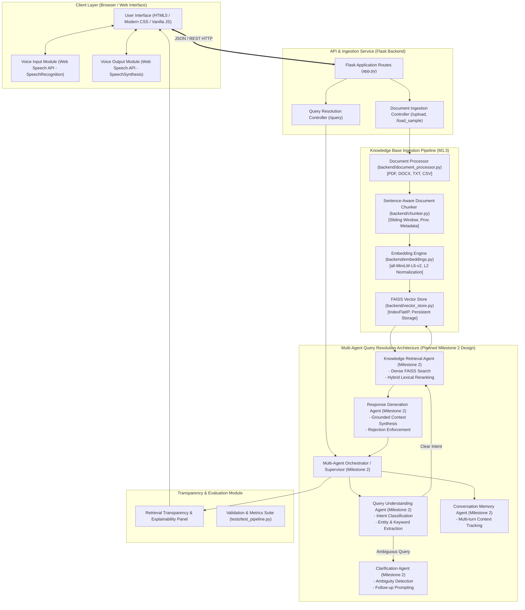

# System Architecture & Technical Design Specification
**Project**: AI-Based Knowledge Retrieval Platform with Query Resolution System  
**Milestone**: Milestone 1 (Foundation & Knowledge Retrieval)  
**Author**: Virtual Internship Project Team  
**Date**: August 2026  

---

## 1. Executive Summary & Problem Formulation

Traditional document retrieval relies on lexical keyword searches (e.g., BM25, grep), which fail when queries are phrased using synonyms, conceptual abstractions, or natural conversational language. Conversely, standalone Large Language Models (LLMs) hallucinate facts and lack access to private, enterprise, or recently updated domain documents.

This platform bridges that gap by implementing an enterprise-grade **Retrieval-Augmented Generation (RAG)** architecture with a modular foundation designed to support **Multi-Agent Query Resolution**, **Web Speech Voice Interaction**, and **Deterministic Factual Grounding**.

---

## 2. End-to-End System Architecture



---

## 3. Multi-Agent Roles & Responsibilities Specification (M1.2)

In accordance with Milestone 1.2, the multi-agent query resolution system decomposes query handling into specialized autonomous roles:

| Agent Name | Core Responsibilities | Input Contract | Output Contract | Milestone 1 Implementation State |
| :--- | :--- | :--- | :--- | :--- |
| **Query Understanding Agent** | Analyzes syntax, intent (Factual, Procedural, Comparative, List), detects domain entities, and normalizes queries. | `raw_query: str` | `UserQuery(cleaned_query, intent, entities)` | Active in `generator._classify_question_type()` & `retriever.py` term extraction. |
| **Clarification Agent** | Detects under-specified queries, zero-entropy questions, or missing context, generating clarifying options instead of guessing. | `UserQuery`, low retrieval confidence | `ClarificationRequest(question, options)` | Modeled in [`models.py`](file:///C:/Users/GeethaJyothi/.gemini/antigravity/scratch/knowledge-retrieval-platform/backend/models.py) (`ClarificationRequest`); active rejection in `generator.py`. |
| **Knowledge Retrieval Agent** | Embeds query, executes vector search on FAISS `IndexFlatIP`, performs candidate oversampling (`fetch_k`), applies lexical reranking, and filters by similarity threshold. | `query_vector: np.ndarray`, `top_k`, `threshold` | `List[RetrievalResult]` | Fully active in [`backend/retriever.py`](file:///C:/Users/GeethaJyothi/.gemini/antigravity/scratch/knowledge-retrieval-platform/backend/retriever.py). |
| **Response Generation Agent** | Synthesizes answers strictly bounded to retrieved context with full provenance citations; rejects out-of-domain queries without hallucination. | `query: str`, `List[RetrievalResult]` | `QueryResponse(answer, confidence, sources)` | Fully active in [`backend/generator.py`](file:///C:/Users/GeethaJyothi/.gemini/antigravity/scratch/knowledge-retrieval-platform/backend/generator.py). |
| **Conversation Memory Agent** | Maintains multi-turn conversation history, tracks referenced documents, and maintains session state. | `session_id`, query/response turns | Context window buffer | Modeled in [`models.py`](file:///C:/Users/GeethaJyothi/.gemini/antigravity/scratch/knowledge-retrieval-platform/backend/models.py) (`AgentMessage`); slated for multi-turn execution in Milestone 2. |

---

## 4. Ingestion Pipeline Data Flow (M1.3)

```
[Document Upload: PDF / DOCX / TXT / CSV]
                     │
                     ▼
       1. DocumentProcessor.extract()
          - Format detection & security sanitization
          - PDF: pypdf page-by-page extraction
          - DOCX: python-docx paragraph extraction
          - TXT: UTF-8 decoded normalization
          - CSV: atomic row-level extraction with header preservation
                     │
                     ▼
       2. DocumentChunker.chunk_document()
          - Sliding-window sentence-aware chunking
          - Window size: 500 characters, Overlap: 100 characters
          - CSV: each row preserved as an atomic record
          - Provenance metadata attached (page_number, row_number, source_id)
                     │
                     ▼
       3. EmbeddingEngine.generate_embeddings()
          - SentenceTransformers local model (`all-MiniLM-L6-v2`)
          - Dimension: 384 float32
          - L2 Unit Normalization (enables inner product == cosine similarity)
                     │
                     ▼
       4. VectorStore.add_documents()
          - FAISS `IndexFlatIP` indexing
          - Atomic persistence to disk (`index.faiss` + `metadata.pkl`)
          - Duplicate document de-duplication & synchronization
```

---

## 5. Core Data Schemas ([`backend/models.py`](file:///C:/Users/GeethaJyothi/.gemini/antigravity/scratch/knowledge-retrieval-platform/backend/models.py))

```python
@dataclass
class DocumentChunk:
    chunk_id: str
    document_name: str
    document_type: str
    text: str
    page_number: Optional[int] = None
    row_number: Optional[int] = None
    source_id: str = ""
    extra_metadata: Dict[str, Any] = field(default_factory=dict)

@dataclass
class RetrievalResult:
    chunk: DocumentChunk
    similarity_score: float
    relevance: str  # "High", "Medium", "Low"

@dataclass
class QueryResponse:
    answer: str
    confidence: str  # "High", "Medium", "Low", "None"
    sources: List[Dict[str, Any]]
    debug_details: Dict[str, Any] = field(default_factory=dict)

@dataclass
class UserQuery:
    raw_query: str
    cleaned_query: str
    intent_category: str = "factual"
    detected_entities: List[str] = field(default_factory=list)
    requires_clarification: bool = False

@dataclass
class AgentMessage:
    sender_agent: str
    recipient_agent: str
    action: str
    payload: Dict[str, Any] = field(default_factory=dict)
    timestamp: Optional[str] = None
```

---

## 6. Web Speech API Integration Specification (M1.1)

1. **Speech-to-Text (Voice Input)**:
   - Utilizes `window.SpeechRecognition` / `window.webkitSpeechRecognition`.
   - Visual pulsation indicator (`.mic-recording`) during speech detection.
   - Automatically populates the question textarea and submits queries on recognition.
2. **Text-to-Speech (Voice Readout)**:
   - Utilizes `window.speechSynthesis` and `SpeechSynthesisUtterance`.
   - User can click the "🔊 Read Aloud" button on any generated response to hear the answer.
   - Includes real-time stop/cancel toggling.

---

## 7. Technology Stack Summary

| Layer | Component | Choice / Library | Justification |
| :--- | :--- | :--- | :--- |
| **Frontend** | UI & Voice | HTML5, Modern CSS, Vanilla JS, Web Speech API | Zero-dependency, native browser compatibility, lightweight |
| **Backend** | API Server | Python 3.11, Flask | Clean RESTful endpoints, direct compatibility with scientific ML packages |
| **Parsing** | Ingestion | `pypdf`, `python-docx`, Python standard `csv` | Format-specific robust extraction with page and row tracking |
| **Embeddings** | Dense Representation | `sentence-transformers` (`all-MiniLM-L6-v2`) | 384-dimensional normalized vectors, local CPU execution, zero external API costs |
| **Vector Index** | Similarity Search | `faiss-cpu` (`IndexFlatIP`) | Extremely fast exact cosine similarity nearest-neighbor retrieval |
| **Generation** | Grounded Synthesis | Dual Mode: Hybrid Extractive Synthesis (Offline) + LLM API (OpenAI/Gemini/Groq) | Guarantees zero hallucinations and runs reliably with or without API keys |
